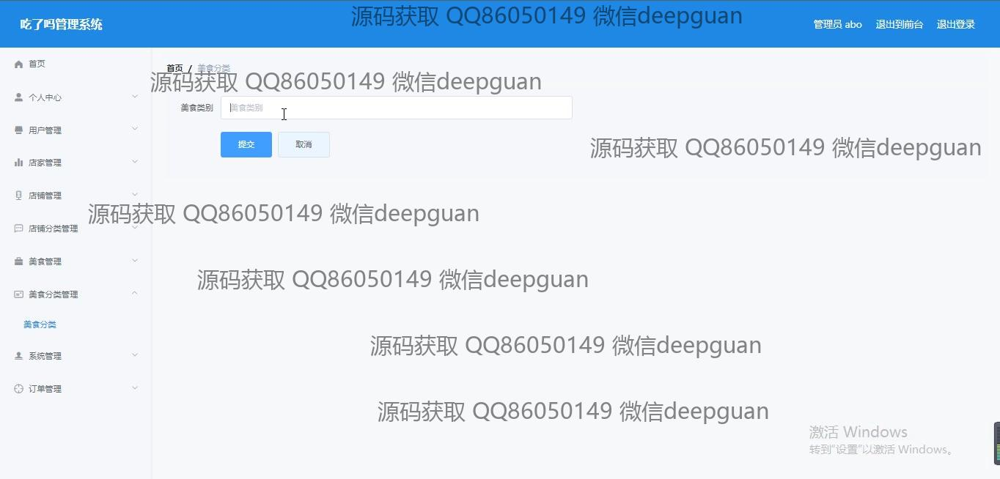

<h1 align="center">基于javaweb的吃了吗管理系统+vue</h1>

## 简介
吃了吗管理系统：角色分为管理员、店家和用户；功能包括用户管理、店铺管理、美食管理、订单管理、个性化配置、购物车及支付管理。适用于餐饮管理。    --计算机毕业设计源码；毕设源码；java毕业设计源码

## 联系方式

<h3 align="center">获取完整代码与数据库文件 + 微信：deepguan QQ: 86050149 QQ群: 783742310</h3>

<h3 align="center">可帮忙远程部署 包运行成功！提供远程部署、修改代码、设计文档指导、代码讲解等服务！</h3>

## 功能介绍（完整见运行截图）
管理员：管理员具备登录、注册和退出等基本功能。通过导航栏，管理员可以访问个人中心以查看和修改个人信息，以及查看订单管理详情和处理用户反馈。在后台管理模块中，管理员可以执行用户管理、店铺管理、美食管理和订单管理等操作。此外，管理员能够在店铺分类和美食分类中进行新增、修改和删除。页面设计简洁直观，注重提高管理操作的效率和用户体验。

用户：用户可以通过系统进行登录与注册，进入主界后可在导航栏快速访问多种功能，包括首页、店铺和购物车。在个人中心，用户可以查看与修改个人信息，管理订单、地址和收藏。在购物模块中，用户可以浏览美食和店铺详情、查询美食分类，通过购物车功能进行商品购买，同时完成订单生成与支付。系统倡导用户个性化配置，方便快捷地完成各类操作，实现高效的餐饮管理。

## 运行截图

本代码来源于网络,仅供学习参考使用!

